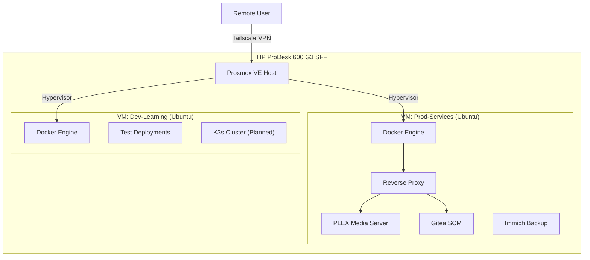

# 🏠 Home Lab: "The ProDesk Build"

A dedicated home laboratory environment focusing on **Infrastructure as Code**, **Container Orchestration**, and **Network Security**. This serves as my playground for testing enterprise-grade deployments and hosting self-sovereign services.

---

## 🏗️ Architecture

## 🖥️ Hardware Specifications

| Component | Specification | Purpose |
|-----------|---------------|---------|
| **Model** | HP ProDesk 600 G3 SFF | Energy-efficient Enterprise PC |
| **CPU** | Intel Core i5 (7th Gen) | Virtualization capability |
| **RAM** | 16 GB DDR4 | Multi-VM memory allocation |
| **Boot Drive**| 256 GB SSD | Fast OS/Hypervisor boot |
| **Storage** | 4 TB HGST 7200RPM HDD | Mass storage for Media & Backups |

## 🛠️ Software Stack

### Core Infrastructure
*   **Hypervisor**: [Proxmox Virtual Environment (PVE)](https://www.proxmox.com/)
*   **Networking**: [Tailscale](https://tailscale.com/) (Mesh VPN for secure remote access without port forwarding)
*   **OS**: Ubuntu Server LTS (Virtual Machines)

### Service Orchestration
*   **Engine**: Docker
*   **Management**: Portainer (Visual management of stacks/containers)
*   **Monitoring**: 
    *   **Netdata**: Real-time performance monitoring.
    *   **Uptime Kuma**: status pages and uptime alerting.
    *   **Scrutiny**: S.M.A.R.T disk health monitoring.

## 🚀 Key Services & Workflows

### 1. DevOps Lifecycle (GitOps-lite)
**Goal**: Mimic professional CI/CD workflows.
*   **Code**: Written on local Dev machine (Windows/Linux Mint).
*   **Push**: Synced to self-hosted **Gitea** instance for redundancy.
*   **Deploy**: Portainer Stacks pull latest images/configs for deployment.

### 2. Media & Productivity
*   **Syncthing**: Keeps my "Second Brain" (Obsidian Vault) synced across all devices (Phone, Laptop, Desktop) in real-time.
*   **Immich**: Professional-grade photo/video backup solution replacing Google Photos.

## 🔮 Future Roadmap

- [ ] **Kubernetes**: Migrating the *Dev-Learning* VM to a unified **k3s** cluster.
- [ ] **Automation**: Implementing **Watchtower** for automated container image updates.
- [ ] **Offsite Backups**: Automating encrypted backups of the 4TB drive to cloud storage (B2/S3).
